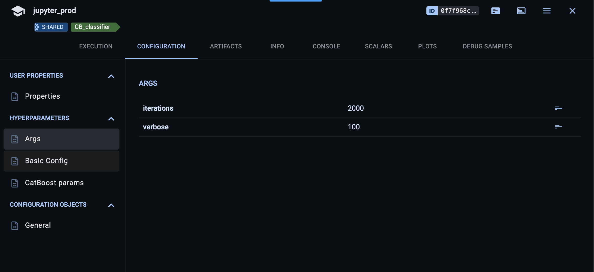
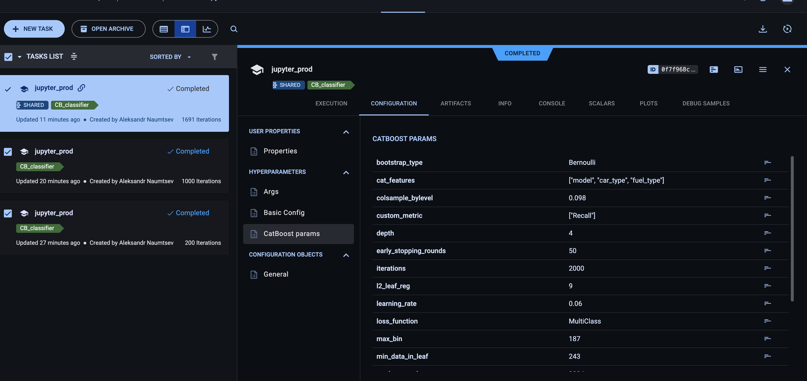
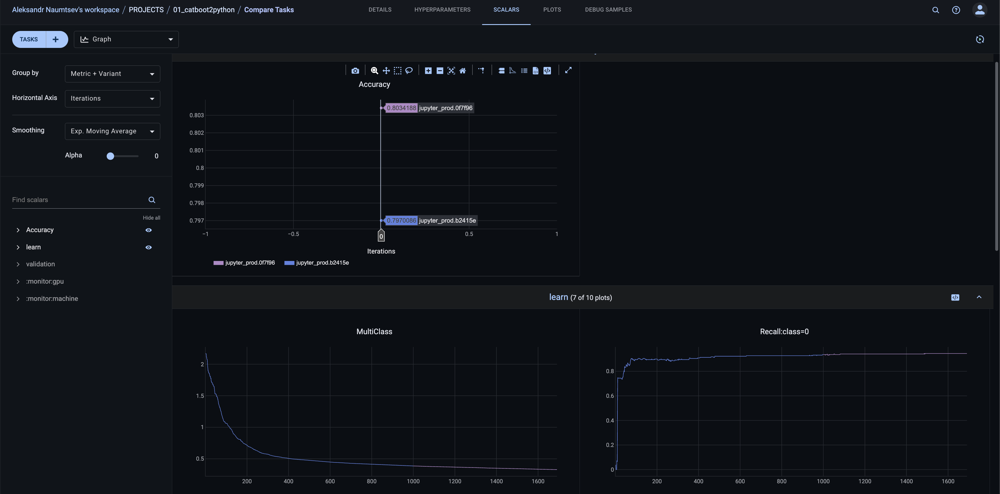
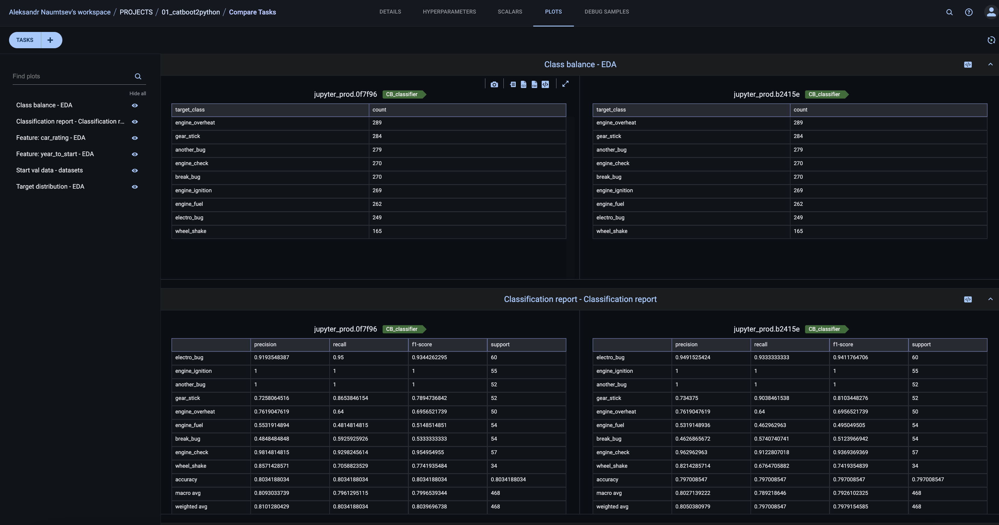

Нужно перенести код из тетрадки в python файлики и провести несколько экспов! 


stapik stage: https://stepik.org/lesson/1500755/step/12?unit=1520869
git: https://github.com/a-milenkin/ml_instruments/blob/main/notebooks/M1_ClearML_practice.ipynb


Все решение в solve положу


Прошлый пример без пропусков 
git: https://github.com/a-milenkin/ml_instruments/blob/main/notebooks/M1_ClearML.ipynb
stepick: https://stepik.org/lesson/1500755/step/5?unit=1520869


---

Запуск 

```python
python pipeline.py --iterations 1000 --verbose 100
```


ShareLink to ClearML
https://app.clear.ml/projects/2e7b04614d2a4d5992075b8d7208d104/experiments/0f7f968c24894f42b511b127943b2a86/output/execution


---

Демки результатов










